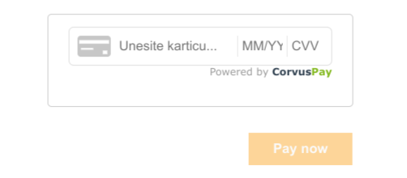
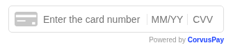
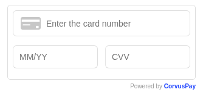
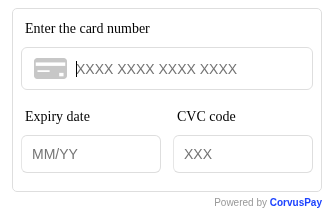

# CorvusFrame Integration for Online Stores

## Table of Contents

- [Overview](#overview)
- [Prerequisites](#prerequisites)
- [Installation](#installation)
- [Frontend Integration](#frontend-integration)
  - [HTML Setup](#html-setup)
  - [JavaScript Setup](#javascript-setup)
    - [Initialize CorvusFrame](#initialize-corvusframe)
    - [Set up CorvusPay form](#set-up-corvuspay-form)
    - [Handle Events](#handle-events)
    - [Initiate Payment](#initiate-payment)
    - [Post-Payment Handling with `doOnFinishCardPayment`](#post-payment-handling-with-doonfinishcardpayment)
    - [Error Handling](#error-handling)
    - [Card Storage](#card-storage)
      - [Saving a card for later use](#saving-a-card-for-later-use)
      - [Using a saved card](#using-a-saved-card)
    - [Subscription](#subscription)
      - [Initialize a subscription payment](#initializing-a-subscription-payment)
- [Backend Integration](#backend-integration)
  - [API Reference](#api-reference)
    - [Securing API Requests](#securing-api-requests)
    - [Initialize Payment](#initialize-payment)
    - [Card Storage API Flow](#card-storage-api-flow)
    - [Subscription API Flow](#subscription-api-flow)
    - [Get Card token](#get-card-token)
    - [Get session token](#get-session-token)
    - [Initialize Payment with Token (Card Storage Only)](#initialize-payment-with-token-card-storage-only)
  - [Calculate Signature](#calculate-signature)
  - [Further Reading](#further-reading)

---

## Overview

This README provides documentation for integrating CorvusFrame, a payment service, into webshop applications.



---

## Prerequisites

- Obtain your Store Secret Key from CorvusPay Merchant Portal. This key is used for signing the API requests in the shop backend application.
- Acquire the CorvusPay Store Public Key for initializing CorvusFrame. The public key is available upon request from CorvusPay support.
- Include the CorvusPay JS Bundle from its external source in your application. This bundle is essential for enabling the payment features.

---

## Installation

Include the CorvusPay JS Bundle in your HTML file.

```html
<script src="https://js.test.corvuspay.com/cjs.bundle.js"></script>
```

---

## Frontend Integration

### HTML Setup

Include the following snippet in your HTML file to create the CorvusFrame payment form.

- `corvuspay-card-element` will be later used to mount the card element.
- `corvuspay-error` will be used to display error messages.
- `item-button` will be used to initiate the payment.

```html
<div id="corvuspay-payment-form">
  <div id="corvuspay-card-element"></div>
  <p id="corvuspay-error" role="alert"></p>
  <div class="item-button-wrapper">
    <input class="item-button" type="submit" value="Pay now" disabled="true" />
  </div>
</div>
```

### JavaScript Setup

1. Initialize CorvusFrame with the public key and optional parameters.
2. Set up your CorvusPay form with customization options.
3. Handle various events, like form readiness, card validation, and errors.

#### Initialize CorvusFrame

To initialize CorvusFrame in your application, you'll need to call the `CorvusPay.init` method. This method accepts two arguments: `requiredParameters` and `optionalParameters`.

##### Required Parameters

`requiredParameters` is an object that should include the CorvusPay Store Public Key acquired from CorvusPay support. This key is essential for API communication and should be kept secure.

```javascript
const requiredParameters = {
  publicKey: CORVUSPAY_STORE_PUBLIC_KEY,
};
```

##### Optional Parameters

` optionalParameters` is an object that can contain additional optional settings. For example, to require that payments can be done in installments, you would set `installmentsRequired` to `true`.

##### Code Example

Here's how you can initialize CorvusFrame with the public key and optional settings:

```javascript
const corvuspay = CorvusPay.init(requiredParameters, optionalParameters);
```

By executing this code, a corvuspay object will be initialized, and you can now proceed to create your payment form and handle events accordingly.

#### Set up CorvusPay form

Once you've initialized CorvusFrame using `CorvusPay.init`, the next step is to set up the CorvusPay form in your application. This is achieved through the `corvuspay.card` method.

##### Options

The `corvuspay.card` method accepts three arguments: `option`, `style`, and `elementAttachIdTo`.

```javascript
const card = corvuspay.card(option, style, "corvuspay-card-element");
```

- `option`: An object containing various optional settings for the CorvusPay form.

  | Option | Variable Type | Description                                                                                                                                                                                                                            |
    |-------------------|---------------|----------------------------------------------------------------------------------------------------------------------------------------------------------------------------------------------------------------------------------------|
  | `hideCorvusPayLogo` | Boolean       | Set to `true` if you want to hide the CorvusPay logo.                                                                                                                                                                                  |
  | `locale` | String        | Set to `hr`, `en`, or `sr` for language of labels and error messages. Default locale is determined by the browser's settings.                                                                                                          |
  | `layout` | String        | Defines form layout. Possible values: `"default"` (inline layout) or `"stacked"` (vertical layout).                                                                                                                                    |
  | `showLabels` | Boolean       | Controls whether labels are displayed above inputs. Works only with `"stacked"` layout.                                                                                                                                                |
  |`cvvOnly` | Boolean | When set to true, the saved-card form hides the stored card information (masked card number and expiration date) and displays only the CVV input. If CVV entry is not required, an empty container is rendered. |

```javascript
const option = {
  hideCorvusPayLogo: false, // Set to true if you want to hide the CorvusPay logo
  locale: "hr", // Specifies the language used for translating error messages and labels. Currently, only English (en) and Croatian (hr) are supported. If another language is provided or the value is missing, the language will be determined by the browser's settings.
  layout: "stacked", // "default" | "stacked"
  showLabels: true,   // true | false (only applies when layout is "stacked")
  cvvOnly: false, // true | false (applies only to the cardWithToken form)
};
```
##### Layout Examples

Below are examples of how the form looks depending on `layout` and `showLabels` options.

---

**Default layout (`layout: "default"`)**

Compact inline form without labels.



---

**Stacked layout without labels (`layout: "stacked", showLabels: false`)**

Compact vertical layout using placeholders instead of labels.



---

**Stacked layout with labels (`layout: "stacked", showLabels: true`)**

Labels are displayed above inputs for better clarity.



##### Styling

- `style`: An object containing style options for the CorvusPay form.

| Option             | Variable Type | Description                                               | Format                          |
|--------------------|---------------|-----------------------------------------------------------|---------------------------------|
| `backgroundColor`  | String        | Background color of the form.                             | Hexadecimal, e.g., "#ffffff"    |
| `fontFamily`       | String        | Font family of the form.                                  | -                               |
| `fontSize`         | Numeric       | Font size of the form.                                    | Numeric                         |
| `fontColor`        | String        | Font color of labels.                                     | Hexadecimal, e.g., "#000000"    |
| `inputFontColor`   | String        | Font color of input values.                               | Hexadecimal, e.g., "#333333"    |
| `borderColor`      | String        | Border color of form fields and container.                | Hexadecimal, e.g., "#dedede"    |
| `cvvCancelBtnBackgroundColor` | String | Background color of the CVV modal Cancel button.          | Hexadecimal, e.g., "#f5f5f5" |
| `cvvCancelBtnFontColor` | String | Text color of the CVV modal Cancel button.                | Hexadecimal, e.g., "#333333" |
| `cvvSuccessBtnBackgroundColor` | String | Background color of the CVV modal Confirm/Success button. | Hexadecimal, e.g., "#007bff" |
| `cvvSuccessBtnFontColor` | String | Text color of the CVV modal Confirm/Success button.       | Hexadecimal, e.g., "#ffffff" |
| `cvvInputBackgroundColor` | String | Background color of the CVV input field in the CVV modal. | Hexadecimal, e.g., "#ffffff" |

```javascript
const style = {
  backgroundColor: "#ffffff", // Background color of the form
  fontFamily: "Arial", // Font family of the form
  fontSize: 13, // Font size of the form
  fontColor: "#000000", // Font color of labels
  inputFontColor: "#333333", // Font color of input values
  borderColor: "#dedede", // Border color of the form fields and container
  cvvCancelBtnBackgroundColor: "#f5f5f5", // Background color of the CVV modal Cancel button
  cvvCancelBtnFontColor: "#333333", // Text color of the CVV modal Cancel button
  cvvSuccessBtnBackgroundColor: "#007bff", // Background color of the CVV modal Confirm/Success button
  cvvSuccessBtnFontColor: "#ffffff", // Text color of the CVV modal Confirm/Success button
  cvvInputBackgroundColor: "#ffffff", // Background color of the CVV input field in the CVV modal
};
```

#### Handle Events

CorvusFrame offers a variety of events that can be listened to, allowing you to handle different scenarios such as when the form is ready, when card data is valid, or when an error occurs. Below is a sample code snippet demonstrating how to handle these events.

```javascript
// This event is fired when the CorvusFrame form is loaded and ready
card.on("ready", () => console.debug(`CorvusPay form is ready 🙂`));

// This event is fired when card data is entered successfully and is valid
card.on("card-ready", (cardReady) => changeCardReadiness(cardReady));

// This event is fired when a validation error occurs within the CorvusFrame form.
// e.g. when card number is invalid
card.on("show-error", (errorMsg) =>
  showErrorMessage(`Validation error: ${errorMsg}`)
);

// This event is fired when a previously reported validation error is no longer present in the CorvusFrame form
card.on("clear-error", (errorMsg) => {
  clearErrorMessage(errorMsg);
});
  
// This event is fired when an error occurs within the CorvusFrame form
card.on("error", (errorMsg) => showErrorMessage(errorMsg));

//This event is fired when discount can be applied for the specific card number
card.on("can-discounted-amount-be-used", (canDiscountedAmountBeUsed) =>
    doOnCanDiscountedAmountBeUsed(canDiscountedAmountBeUsed)
);

//This event is fired when card brand is detected or changed
card.on("card-info", (cardInfo) =>
    doOnCardInfo(cardInfo)
);

// This event is fired when diagnostic information is available from CorvusFrame.
// It can be used for debugging, monitoring, or forwarding safe diagnostic data to your backend.
card.on("diagnostics", (diagnostics) => 
        handleDiagnostics(diagnostics)
);

```

- `ready`: Triggered when the CorvusFrame form is loaded and ready.
- `card-ready`: Triggered when the card data is valid.
- `show-error`: Triggered when a validation error occurs.
- `clear-error`: Triggered when a validation error is no longer present.
- `error`: Triggered when any error occurs within the CorvusFrame form.
- `show-modal`: Triggered when the CorvusFrame form changes size. This occurs when 3D secure authentication is required. This event includes the following properties:
  - `heightToBeSet`: The new height of the CorvusFrame form.
  - `widthToBeSet`: The new width of the CorvusFrame form.
- `hide-modal`: Triggered when the CorvusFrame form reverts to its original size. This occurs after 3D secure authentication is finished. This event includes the following properties:
  - `heightToBeSet`: The restored height of the CorvusFrame form.
  - `widthToBeSet`: The restored width of the CorvusFrame form.
- `installments-calculated`: Triggered when installments are calculated for the entered PAN. This event includes the following properties:
  - `minInstallments`: The minimum number of installments possible for the provided card.
  - `maxInstallments`: The maximum number of installments possible for the provided card.
  - `minAmount`: The minimum amount required for these installments, in cents.
- `can-discounted-amount-be-used`: Triggered when discount can be applied for the specific card number. This event includes the following properties:
  - `canDiscountedAmountBeUsed`: Indicates whether discount can be applied for the specific card number. (Boolean value)
- `card-info`: Triggered when card brand is detected or changed. This event includes the following properties:
  - `cardInfo`: String value containing card brand.
- `diagnostics`: Triggered when CorvusFrame emits diagnostic information about the checkout flow. This event can be used for debugging and monitoring purposes. It may be fired for lifecycle events, backend communication steps, payment processing. This event includes the following properties:
  - `source`: Source of the diagnostic event. Default value is `corvuspay-js-lib`.
  - `level`: Diagnostic level, for example `INFO`, `WARN`, or `ERROR`.
  - `event`: Name of the diagnostic event, for example `finishCardPayment`, `card-ready`, or `ready`.
  - `message`: Human-readable diagnostic message.
  - `errorCode`: Error code, when available.
  - `errorMessage`: Technical error message, when available.
  - `paymentId`: Payment ID related to the diagnostic event, when available.
  - `publicKey`: Public key related to the diagnostic event, when available.
  - `endpoint`: Backend endpoint related to the diagnostic event, when available.
  - `timestamp`: Time when the diagnostic event was created.

These events help you manage different stages and errors during the payment process.

#### Initiate Payment

To initiate a payment, customer and purchase information is first collected. This information is then sent to the shop backend for further processing. Below is an example code snippet that demonstrates the payment initiation process.

```javascript
// Sample customer details
  const customer = {
    cardholderName: "Test",
    cardholderSurname: "Test",
    cardholderAddress: "Buzinski prilaz 10",
    cardholderCity: "Zagreb",
    cardholderZipCode: "10000",
    cardholderCountry: "Croatia",
    cardholderEmail: "test.test@corvuspay.com",
    cardholderCountryCode: "HR"
  };

  // Sample purchase details
  const purchase = {
    amount: 12.23, // amount in currency unit, not cents
    currency: "EUR", // currency in ISO 4217 format
    cart: "Product 1", // cart description
  };
  
  // If discount can be used, send additional fields in the request
  if (canDiscountedAmountBeUsedByTheShop) {
    purchase.original_amount = purchase.amount; // the original amount without discount
    purchase.amount = 10.23; // the amount with discount that will be used for charging the customer
    purchase.discounted_amount_used = true; // boolean that tells us that discount is used
  }

  const paymentInfo = {
    customer: JSON.stringify(customer),
    purchase: JSON.stringify(purchase),
  };

  // Send paymentInfo to your backend
  fetch("/corvuspay-init-payment", {
    method: "POST",
    headers: {
      "Content-Type": "application/json",
    },
    body: JSON.stringify(paymentInfo),
  })
  ...
```

Shop backend should then call the CorvusPay API to initialize the payment. The API response will contain the payment ID, which is then used to complete the payment.

After the payment is successfully initialized and the payment ID is obtained, the `card.finishCardPayment` method is called to complete the payment. The `doOnFinishCardPayment` function is invoked upon the completion of the payment to handle any post-payment actions or validations.

```javascript
card.finishCardPayment(data.payment_id, doOnFinishCardPayment);
```

#### Post-Payment Handling with `doOnFinishCardPayment`

After the payment process is complete, the doOnFinishCardPayment function is invoked to handle the results. This function takes an object [CardPaymentResult](#cardpaymentresult-object) as an argument, which contains following properties :

##### CardPaymentResult Object

| Property         | Variable Type | Description                                                                           |
| ---------------- | ------------- | ------------------------------------------------------------------------------------- |
| `paymentId`      | String        | The payment ID that was sent in the request.                                          |
| `status`         | String        | Indicates the status of the transaction: "ok" if approved, "nok" if declined.         |
| `errorCode`      | String        | Reason for the decline. Empty if the status is "ok".                                  |
| `displayMessage` | String        | A message that can be displayed to the cardholder in case of "nok" status.            |
| `signature`      | String        | SHA256 HMAC of all values. Available only if the status is "ok".                      |
| `approvalCode`   | String        | Approval code for the transaction, or an empty string if the transaction is declined. |

> **Note:** The `signature` parameter should be validated by the shop backend using the Store Secret Key.

##### Error Codes

The errorCode field in CardPaymentResult can contain one of the following values:

| Error Code | Explanation                                                                                                                             |
|------------|-----------------------------------------------------------------------------------------------------------------------------------------|
| 1050       | Unexpected error occurred while communicating with the payment service.                                                                 |
| 1826       | The payment request failed due to a network or transport error. The client could not successfully communicate with the payment service. |
| 1827       | The payment service returned a response that could not be processed because it was invalid or in an unexpected format.                  |

These codes are returned in CardPaymentResult.errorCode when status is nok.

**Note:** For `1826` and `1827`, the payment outcome may be unknown from the client side. It is recommended to check the transaction status on the backend before retrying the payment or showing a final result to the customer.

##### Constants

- `CardPaymentResult.PAYMENT_OK`: A constant with the value "ok", indicating transaction approval.
- `CardPaymentResult.PAYMENT_NOK`: A constant with the value "nok", indicating transaction decline.

#### Error Handling

Error messages can be displayed using the `corvuspay-error` element in HTML. Capture and handle errors appropriately in your JavaScript code.

### Card Storage

Use card storage when the customer wants to save a card for later checkout payments with the same merchant. The saved card 
is linked only to that specific merchant and cannot be used by other merchants.

In this flow, the merchant identifies the customer with `user_card_profiles_id`, stores the returned card token on the 
backend, and later uses both values to display CorvusFrame with the saved card data.

Card storage is separate from subscription. If the goal is to register a card for a recurring subscription payment, use the
[Subscription](#subscription) chapter instead.

#### Saving a card for later use

To save a card, initialize and display the standard CorvusFrame card form with `corvuspay.card(...)`, exactly as in the
standard payment flow. The customer enters the full card data for this initial transaction.

When the shop backend initializes this payment, it must send the additional card storage fields described in
[Card Storage API Flow](#card-storage-api-flow):

- `save_card: true`
- `card_storage_type: "CARD_STORAGE"`
- `user_card_profiles_id`: the customer identifier from the merchant system

After the initial payment is approved, the shop backend should call `/api/js/1.0/get-token` and store the returned
`token_value` together with the same `user_card_profiles_id`. These values are needed when the customer later pays with
the saved card.

#### Using a saved card

When a saved card is used, the customer does not re-enter the full card details. The customer only enters the required CVV,
if CVV is requested, and confirms their identity when 3D Secure authentication is required.

Before displaying the saved-card form, the shop backend must fetch a temporary `session_token` using the saved
`user_card_profiles_id` and `token_value`. See [Get session token](#get-session-token).

##### Initialize CorvusFrame form with token

The base CorvusFrame initialization is the same as for standard payments:

```javascript
const corvuspay = CorvusPay.init(requiredParameters, optionalParameters);
```

##### Set up CorvusPay form with token
After CorvusFrame is initialized, display the saved-card form with `cardWithToken`. The `corvuspay.cardWithToken` method
accepts four arguments: `sessionToken`, `option`, `style`, and `elementAttachIdTo`.

```javascript
const cardWithToken = corvuspay.cardWithToken(sessionToken, option, style, "corvuspay-card-with-token-element");
```

Use the same event handlers as the standard card form.

##### Initiate payment with token

For a saved-card payment, send the purchase data and `sessionToken` to the shop backend. The backend should initialize the
payment with `/api/js/1.0/init-payment-with-token`; see
[Initialize Payment with Token (Card Storage Only)](#initialize-payment-with-token-card-storage-only).

```javascript
  // Sample purchase details
  const purchase = {
    amount: 12.23, // amount in currency unit, not cents
    currency: "EUR", // currency in ISO 4217 format
    cart: "Product 1", // cart description
  };

  // If discount can be used, send additional fields in the request
  if (canDiscountedAmountBeUsedByTheShop) {
    purchase.original_amount = purchase.amount; // the original amount without discount
    purchase.amount = 10.23; // the amount with discount that will be used for charging the customer
    purchase.discounted_amount_used = true; // boolean that tells us that discount is used
  }

  const paymentInfo = {
    purchase: JSON.stringify(purchase),
    sessionToken: JSON.stringify(this.sessionToken)
  };

  // Send paymentInfo to your backend to initiate payment with token
  fetch("/corvuspay-init-payment-with-token", {
    method: "POST",
    headers: {
      "Content-Type": "application/json",
    },
    body: JSON.stringify(paymentInfo),
  })
  ...
```

The shop backend response contains the `payment_id` used to complete the saved-card payment:

```javascript
cardWithToken.finishCardPayment(data.payment_id, doOnFinishCardPayment);
```

### Subscription

Use subscription when the initial payment should register the card for a recurring subscription flow. This is not the same
as card storage for customer-selected saved cards.

For a standard subscription setup:

- Use the standard CorvusFrame card form with `corvuspay.card(...)`.
- The customer enters the full card data during the initial subscription payment.
- The backend initializes the payment with `save_card: true` and `card_storage_type: "SUBSCRIPTION"`.
- Do not send `user_card_profiles_id` for a standard subscription.
- Do not use `cardWithToken`, `/api/js/1.0/get-session-token`, or `/api/js/1.0/init-payment-with-token` for the subscription setup.

#### Initializing a subscription payment

Initialize CorvusFrame and set up the card form as described in [Initialize CorvusFrame](#initialize-corvusframe) and
[Set up CorvusPay form](#set-up-corvuspay-form). When the customer submits the payment, send the customer and purchase
data to the shop backend.

The shop backend should initialize the subscription payment with the additional fields described in
[Subscription API Flow](#subscription-api-flow):

- `save_card: true`
- `card_storage_type: "SUBSCRIPTION"`

After the initial subscription payment is approved, the shop backend should call `/api/js/1.0/get-token` and handle the
returned token according to the subscription process agreed with CorvusPay.

---

For complete JavaScript code, refer to the [shop.js sample](samples/demo-payment-page/frontend/shop.js).

For complete JavaScript code for saving a card with card storage and using a saved card with card storage refer to [card-storage.js sample](samples/demo-payment-with-token-page/frontend/card-storage.js)

## Backend Integration

Before diving into the API Reference, it's essential to understand how to integrate CorvusPay with your shop's backend. The backend plays a crucial role in:

- Initializing payments and generating a payment ID
- Fetching tokens for card storage or subscription flows
- Validating the `signature` using the Store Secret Key
- Handling various transaction states such as success, failure, and pending transactions

**Important Notice:** Note that operations requiring the Store Secret Key should be performed on the backend to maintain security and integrity.

Please proceed to the API Reference for a detailed explanation of each API endpoint and its usage.

### API Reference

For testing purposes, use the following URL: `https://wallet.test.corvuspay.com`.

For production, use: `https://wallet.corvuspay.com`.

#### Securing API Requests

To access the API, it is mandatory to sign your request using your Store Secret Key. For details on how to generate this signature, please refer to the [Calculate Signature](#calculate-signature) section.
Additionally, a **client certificate** is required for authentication. Contact CorvusPay support to obtain this certificate.

#### Initialize Payment

Initialize payment by sending a POST request to the following endpoint:

`endpoint: /api/js/1.0/init-payment`

Use this endpoint for a standard one-time payment, for the initial card storage payment, and for the initial subscription
payment. The table below contains the common request fields. If you are starting card storage or subscription, add only
the extra fields from the matching chapter:

- [Card Storage API Flow](#card-storage-api-flow)
- [Subscription API Flow](#subscription-api-flow)

##### Request Body

| Parameter                 | Data Type | Required | Example        | Description                                                                                                                                                                                                                                                                                                                                                                                                        |
|---------------------------|-----------|----------|----------------|--------------------------------------------------------------------------------------------------------------------------------------------------------------------------------------------------------------------------------------------------------------------------------------------------------------------------------------------------------------------------------------------------------------------|
| `version`                 | String    | Yes      | "1.6"          | Version of CorvusPay API                                                                                                                                                                                                                                                                                                                                                                                           |
| `store_id`                | String    | Yes      | "1"            | Store Id                                                                                                                                                                                                                                                                                                                                                                                                           |
| `order_number`            | String    | Yes      | "ORDER_123"    | Unique order number                                                                                                                                                                                                                                                                                                                                                                                                |
| `language`                | String    | No       | "hr"           | ISO 639-1 language code                                                                                                                                                                                                                                                                                                                                                                                            |
| `currency`                | String    | Yes      | "EUR"          | Currency in ISO 4217 format                                                                                                                                                                                                                                                                                                                                                                                        |
| `amount`                  | String    | Yes      | "123.54"       | Amount to be charged in currency unit                                                                                                                                                                                                                                                                                                                                                                              |
| `cart`                    | String    | Yes      | "2x Item"      | Shopping-cart contents description                                                                                                                                                                                                                                                                                                                                                                                 |
| `require_complete`        | Boolean   | Yes      | `true`         | If `true`, payment will be finished only when order completion is confirmed                                                                                                                                                                                                                                                                                                                                        |
| `signature`               | String    | Yes      | _Calculated_   | HMAC-SHA256 signature. See [Calculate Signature](#calculate-signature)                                                                                                                                                                                                                                                                                                                                             |
| `save_card`               | Boolean   | No       | `false`        | Use `false` or omit for standard one-time payments. Use `true` only for card storage or subscription flows.                                                                                                                                                                                                                                                                                                       |
| `cardholder_name`         | String    | Yes      | "John"         | Name of the cardholder                                                                                                                                                                                                                                                                                                                                                                                             |
| `cardholder_surname`      | String    | Yes      | "Doe"          | Surname of the cardholder                                                                                                                                                                                                                                                                                                                                                                                          |
| `cardholder_address`      | String    | No       | "123 St"       | Address of the cardholder                                                                                                                                                                                                                                                                                                                                                                                          |
| `cardholder_city`         | String    | No       | "Zagreb"       | City of the cardholder                                                                                                                                                                                                                                                                                                                                                                                             |
| `cardholder_zip_code`     | String    | No       | "10000"        | ZIP code of the cardholder                                                                                                                                                                                                                                                                                                                                                                                         |
| `cardholder_country`      | String    | No       | "Croatia"      | Country of the cardholder                                                                                                                                                                                                                                                                                                                                                                                          |
| `cardholder_country_code` | String    | Yes      | "HR"           | Two-letter ISO 3166-1 alpha-2 country code of the cardholder                                                                                                                                                                                                                                                                                                                                                       |
| `cardholder_email`        | String    | Yes      | "a@a.com"      | Email address of the cardholder                                                                                                                                                                                                                                                                                                                                                                                    |
| `number_of_installments`  | String    | No       | 06             | The number of installments selected for the payment. Set this field only if the `installments-calculated` event returns a `minInstallments` value greater than 1, indicating that installment payments are available. The value should fall between the returned `minInstallments` and `maxInstallments`.                                                                                                          |
| `original_amount`         | String    | No       | "123.54"       | Amount before applied discount                                                                                                                                                                                                                                                                                                                                                                                     |
| `discounted_amount_used`  | Boolean   | No       | `true`         | Indicates if discounted amount is used                                                                                                                                                                                                                                                                                                                                                                             |

##### Response Body

| Parameter    | Data Type | Required | Example                  | Description       |
| ------------ | --------- | -------- | ------------------------ | ----------------- |
| `payment_id` | String    | Yes      | "1MO0qMfkajkAjqHZro1RGo" | Unique payment ID |

##### Example of initializing payment

```javascript
// create the request body
const initPaymentRequest = {
  version: "1.6", // version of CorvusPay API
  store_id: CORVUSPAY_STORE_ID,
  // ... [rest of the fields]
};

// Calculate the signature for the request
initPaymentRequest.signature = calculateSignature(
  initPaymentRequest,
  CORVUSPAY_SECRET_KEY
);

const data = JSON.stringify(initPaymentRequest);

const options = {
  method: "POST",
  hostname: CORVUSPAY_HOSTNAME,
  port: CORVUSPAY_PORT,
  path: "/api/js/1.0/init-payment",
  headers: {
    Accept: "application/json",
    "Content-type": "application/json",
    "Content-Length": data.length,
  },
};

let cpReq = https.request(options, function (cpRes) {
  // handle response
}
```

#### Card Storage API Flow

Use this flow when the merchant wants to let a customer save a card and use it for later checkout payments.

The initial card storage transaction uses the same `/api/js/1.0/init-payment` endpoint as a standard payment. The frontend
should display the standard CorvusFrame card form with `corvuspay.card(...)`, because the customer enters the full card data
for this first transaction.

##### Additional `init-payment` fields for card storage

| Parameter               | Data Type | Required | Example        | Description                                                                                          |
|-------------------------|-----------|----------|----------------|------------------------------------------------------------------------------------------------------|
| `save_card`             | Boolean   | Yes      | `true`         | Must be `true` when saving a card for card storage.                                                  |
| `card_storage_type`     | String    | Yes      | "CARD_STORAGE" | Selects the card storage flow.                                                                       |
| `user_card_profiles_id` | String    | Yes      | "SHOP_12346"   | Customer identifier from the merchant system. This value is later used to fetch the session token.   |

##### Example of initializing card storage payment

```javascript
const initCardStoragePaymentRequest = {
  version: "1.6",
  store_id: CORVUSPAY_STORE_ID,
  order_number: orderNumber,
  currency: purchase.currency,
  amount: purchase.amount,
  cart: purchase.cart,
  require_complete: true,
  save_card: true,
  card_storage_type: "CARD_STORAGE",
  user_card_profiles_id: userCardProfileId,
  cardholder_name: customer.cardholderName,
  cardholder_surname: customer.cardholderSurname,
  cardholder_country_code: customer.cardholderCountryCode,
  cardholder_email: customer.cardholderEmail,
};
```

After the initial card storage payment is approved, call `/api/js/1.0/get-token` and store the returned `token_value`
together with `user_card_profiles_id`. For later payments with this saved card:

1. Fetch a `session_token` with `/api/js/1.0/get-session-token`.
2. Display the saved-card form with `corvuspay.cardWithToken(sessionToken, option, style, elementAttachIdTo)`.
3. Initialize the payment with `/api/js/1.0/init-payment-with-token`.
4. Complete the payment with `cardWithToken.finishCardPayment(...)`.

#### Subscription API Flow

Use this flow when the initial payment should register a card for a recurring subscription. This flow is separate from
card storage for customer-selected saved cards.

The initial subscription transaction uses the same `/api/js/1.0/init-payment` endpoint as a standard payment. The frontend
should display the standard CorvusFrame card form with `corvuspay.card(...)`.

##### Additional `init-payment` fields for subscription

| Parameter           | Data Type | Required | Example        | Description                                      |
|---------------------|-----------|----------|----------------|--------------------------------------------------|
| `save_card`         | Boolean   | Yes      | `true`         | Must be `true` when starting a subscription.     |
| `card_storage_type` | String    | Yes      | "SUBSCRIPTION" | Selects the subscription flow.                   |

Do not send `user_card_profiles_id` for a standard subscription. That field belongs to the card storage flow.

##### Example of initializing subscription payment

```javascript
const initSubscriptionPaymentRequest = {
  version: "1.6",
  store_id: CORVUSPAY_STORE_ID,
  order_number: orderNumber,
  currency: purchase.currency,
  amount: purchase.amount,
  cart: purchase.cart,
  require_complete: true,
  save_card: true,
  card_storage_type: "SUBSCRIPTION",
  cardholder_name: customer.cardholderName,
  cardholder_surname: customer.cardholderSurname,
  cardholder_country_code: customer.cardholderCountryCode,
  cardholder_email: customer.cardholderEmail,
};
```

After the initial subscription payment is approved, call `/api/js/1.0/get-token` and handle the returned token according
to the subscription process agreed with CorvusPay. Do not use `/api/js/1.0/get-session-token`,
`corvuspay.cardWithToken(...)`, or `/api/js/1.0/init-payment-with-token` for the standard subscription setup.

#### Get Card token

Call this endpoint after an approved initial payment where `save_card` was set to `true`:

- For card storage, `card_storage_type` was `CARD_STORAGE`. Store the returned `token_value` with the customer's
  `user_card_profiles_id`.
- For subscription, `card_storage_type` was `SUBSCRIPTION`. Use the returned token for initiating next subscription payment,
as documented in the CorvusPay Integration manual.

Do not call this endpoint for standard one-time payments or for later saved-card payments initialized with
`/api/js/1.0/init-payment-with-token`.

To get the card token, send a POST request to the following endpoint:

`endpoint: /api/js/1.0/get-token`

##### Request Body

| Parameter    | Data Type | Required | Example                          | Description                                                  |
| ------------ | --------- | -------- |----------------------------------|--------------------------------------------------------------|
| `version`    | String    | No       | `1.6`                            | API version. Should be 1.6                                   |
| `store_id`   | String    | Yes      | `123`                            | Store Id                                                     |
| `payment_id` | String    | No       | `ip_hkBWcPgFom...Kn51F9k4WCWeKo` | Payment Id                                                   |
| `signature`  | String    | Yes      | `4be5aef695c...8b2ad4de5c74`     | HMAC-SHA256. See [Calculate Signature](#calculate-signature) |

##### Response Body

| Parameter            | Data Type | Required | Example                  | Description                            |
| -------------------- | --------- | -------- | ------------------------ | -------------------------------------- |
| `token_value`        | String    | Yes      | `5vNzKHNeCvWvc3pSOWIBMe` | A token in new format of 22 characters |
| `token_expiry_year`  | String    | Yes      | `2030`                   | Token expiry year                      |
| `token_expiry_month` | String    | Yes      | `12`                     | Token expiry month                     |
| `masked_pan`         | String    | Yes      | `************1111`       | Masked PAN                             |

##### Example of getting card token

```javascript
const options = {
      method: "POST",
      hostname: CORVUSPAY_HOSTNAME,
      port: CORVUSPAY_PORT,
      path: "/api/js/1.0/get-token",
      headers: {
        Accept: "application/json",
        "Content-type": "application/json",
      },
    };

    let requestBody = {
      version: "1.6",
      store_id: storeId,
      payment_id: paymentId,
    };

    requestBody.signature = calculateSignature(requestBody, CORVUSPAY_SECRET_KEY);

    const data = JSON.stringify(requestBody);
    console.debug("Sending request to CorvusPay...", data, "\n");
    let cpReq = https.request(options, function (cpRes) {
      // handle response
    }
```

#### Get session token

Use this endpoint only for card storage, when the customer chooses a saved card for a later checkout payment. It is not
used for the standard subscription flow.

Before rendering `corvuspay.cardWithToken(...)`, fetch a temporary `session_token` using the `user_card_profiles_id` and
the `token_value` saved after the initial card storage transaction. To fetch the session token, send a POST request to the
following endpoint:

`endpoint: /api/js/1.0/get-session-token`

##### Request Body

| Parameter               | Data Type | Required | Example                      | Description                                                         |
|-------------------------| --------- | -------- |------------------------------|---------------------------------------------------------------------|
| `version`               | String    | No       | `1.6`                        | API version. Should be 1.6                                          |
| `store_id`              | String    | Yes      | `123`                        | Store Id                                                            |
| `user_card_profiles_id` | String    | Yes      | `SHOP_12346`                 | User card profiles id used when initiating card storage transaction |
| `token_value`           | String    | Yes      | `5vNzKHNeCvWvc3pSOWIBMe`     | Token value, acquired in the get_token call                         |
| `signature`             | String    | Yes      | `4be5aef695c...8b2ad4de5c74` | HMAC-SHA256. See [Calculate Signature](#calculate-signature)        |

##### Response Body

| Parameter                | Data Type | Required | Example                                          | Description                       |
|--------------------------| --------- | -------- |--------------------------------------------------|-----------------------------------|
| `session_token`          | String    | Yes      | `st_M09BTYSZ3w7tq4V3DrabsWVPjO7uYr9kC6UI6aFeHY8` | Session token                     |
| `session_token_validity` | String    | Yes      | 60                                               | Session token validity in minutes |

##### Example of getting session token

```javascript
    const options = {
      method: "POST",
      hostname: CORVUSPAY_HOSTNAME,
      port: CORVUSPAY_PORT,
      path: "/api/js/1.0/get-session-token",
      headers: {
        Accept: "application/json",
        "Content-type": "application/json",
        "Content-Length": data.length,
      },
    };
    let requestBody = {
      version: "1.6",
      store_id: storeId,
      user_card_profiles_id: userCardProfileId,
      token_value: token_value,
    }
    requestBody.signature = calculateSignature(requestBody, CORVUSPAY_SECRET_KEY);
    const data = JSON.stringify(requestBody);
    console.debug("Sending request to CorvusPay...", data, "\n");
    let cpReq = https.request(options, function (cpRes) {
      // handle response
    }
    
```

#### Initialize Payment with Token (Card Storage Only)

Use this endpoint only for later payments with a card saved through the card storage flow. It is not used for standard
one-time payments or for the standard subscription setup.

After fetching a `session_token` for the saved card, initialize the saved-card payment by sending a POST request to the
following endpoint:

`endpoint: /api/js/1.0/init-payment-with-token`

##### Request Body

| Parameter                | Data Type | Required | Example        | Description                                                                                                                                                                                                                                                                                               |
|--------------------------|-----------|----------|----------------|-----------------------------------------------------------------------------------------------------------------------------------------------------------------------------------------------------------------------------------------------------------------------------------------------------------|
| `version`                | String    | Yes      | "1.6"          | Version of CorvusPay API                                                                                                                                                                                                                                                                                  |
| `session_token`          | String    | Yes      | "st_M09...HY8" | Session token acquired in the previous step                                                                                                                                                                                                                                                               |
| `store_id`               | String    | Yes      | "1"            | Store Id                                                                                                                                                                                                                                                                                                  |
| `order_number`           | String    | Yes      | "ORDER_123"    | Unique order number                                                                                                                                                                                                                                                                                       |
| `language`               | String    | No       | "hr"           | ISO 639-1 language code                                                                                                                                                                                                                                                                                   |
| `currency`               | String    | Yes      | "EUR"          | Currency in ISO 4217 format                                                                                                                                                                                                                                                                               |
| `amount`                 | String    | Yes      | "123.54"       | Amount to be charged in currency unit                                                                                                                                                                                                                                                                     |
| `cart`                   | String    | Yes      | "2x Item"      | Shopping-cart contents description                                                                                                                                                                                                                                                                        |
| `cardholder_country_code` | String    | Conditional | "HR"       | Two-letter ISO 3166-1 alpha-2 country code of the cardholder. Required if it was not provided when the card was originally saved.                                                                                                                                                                                                                                  |
| `require_complete`       | Boolean   | Yes      | `true`         | If `true`, payment will be finished only when order completion is confirmed                                                                                                                                                                                                                               |
| `number_of_installments` | String    | No       | 06             | The number of installments selected for the payment. Set this field only if the `installments-calculated` event returns a `minInstallments` value greater than 1, indicating that installment payments are available. The value should fall between the returned `minInstallments` and `maxInstallments`. |
| `signature`              | String    | Yes      | _Calculated_   | HMAC-SHA256 signature. See [Calculate Signature](#calculate-signature)                                                                                                                                                                                                                                    |
| `original_amount`        | String    | No       | "123.54"       | Amount before applied discount                                                                                                                                                                                                                                                                            |
| `discounted_amount_used` | Boolean   | No       | `true`         | Indicates if discounted amount is used                                                                                                                                                                                                                                                                    |

Note: cardholder_country_code is required for init-payment-with-token only if it was not included when the card was saved. If it is missing from both requests, the payment initialization will fail.

##### Response Body

| Parameter    | Data Type | Required | Example                  | Description       |
| ------------ | --------- | -------- | ------------------------ | ----------------- |
| `payment_id` | String    | Yes      | "1MO0qMfkajkAjqHZro1RGo" | Unique payment ID |

##### Example of initializing payment

```javascript
// create the request body
const initPaymentWithTokenRequest = {
  version: "1.6", // version of CorvusPay API
  store_id: CORVUSPAY_STORE_ID,
  session_token: sessionToken, // session token received in the fetch-session-token call
  // ... [rest of the fields]
};

// Calculate the signature for the request
initPaymentWithTokenRequest.signature = calculateSignature(
        initPaymentWithTokenRequest,
        CORVUSPAY_SECRET_KEY
);

const data = JSON.stringify(initPaymentWithTokenRequest);

const options = {
  method: "POST",
  hostname: CORVUSPAY_HOSTNAME,
  port: CORVUSPAY_PORT,
  path: "/api/js/1.0/init-payment-with-token",
  headers: {
    Accept: "application/json",
    "Content-type": "application/json",
    "Content-Length": data.length,
  },
};

let cpReq = https.request(options, function (cpRes) {
  // handle response
}
```

### Calculate Signature

Calculating the signature is a vital step to ensure secure communication with the API. The signature authenticates the API request, ensuring that the data hasn't been tampered with during transmission.

#### General Steps

1. **Filter Out Signature Field**: Begin by taking the request parameters and omitting the field labeled as "signature," if present.
2. **Sort Parameters Alphabetically**: Sort the remaining keys of the parameters in alphabetical order.
3. **Concatenate Sorted Entries**: Combine the sorted key-value pairs into a single, uninterrupted string.
4. **Generate HMAC-SHA256 Hash**: Use the concatenated string and your store's secret key to generate an HMAC-SHA256 hash.
5. **Convert to Hexadecimal**: Finally, transform the hash into a hexadecimal string. This value will serve as the signature for your API request.

##### Example of Calculating Signature in JavaScript

```javascript
const calculateSignature = (params, secretKey) => {
  const sortedEntries = Object.entries(params)
    .filter(([key]) => key.toLowerCase() !== "signature")
    .sort(([keyA], [keyB]) => keyA.localeCompare(keyB))
    .map(([key, value]) => `${key}${value}`)
    .join("");

  const hash = hmacSHA256(sortedEntries, secretKey);

  return hash.toString(CryptoJS.enc.Hex);
};
```

##### Example of Calculating Signature in Java

```java
public static String calculateSignature(String secretKey, Map<String, String> params) throws NoSuchAlgorithmException, InvalidKeyException {
    // Sort and concatenate the parameters, excluding the "signature" key
    String requestParamsStr = params.entrySet().stream()
        .filter(entry -> !entry.getKey().equalsIgnoreCase("signature"))
        .sorted(Map.Entry.comparingByKey())
        .map(s -> s.getKey() + s.getValue())
        .collect(Collectors.joining());

    // Initialize HMAC and SecretKey
    SecretKeySpec secret = new SecretKeySpec(secretKey.getBytes(StandardCharsets.UTF_8), "HmacSHA256");
    Mac sha256HMAC = Mac.getInstance("HmacSHA256");
    sha256HMAC.init(secret);

    // Calculate the signature
    byte[] hashBytes = sha256HMAC.doFinal(requestParamsStr.getBytes(StandardCharsets.UTF_8));
    return Hex.encodeHexString(hashBytes);
  }

```

## Further Reading

Be aware that if you set `require_complete=true`, you will need to complete the payment either through the CorvusPay API or via the Merchant Portal. Comprehensive documentation on the CorvusPay API and other integration options can be obtained from CorvusPay support.
