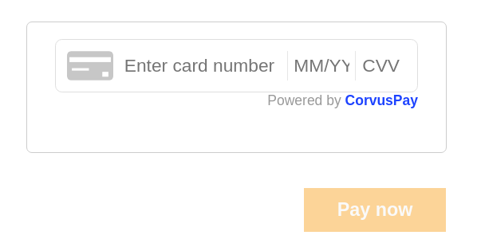

# CorvusFrame Integration for Online Stores

## Table of Contents

- [Overview](#overview)
- [Prerequisites](#prerequisites)
- [Installation](#installation)
- [Frontend Integration](#frontend-integration)
  - [HTML Setup](#html-setup)
  - [JavaScript Setup](#javascript-setup)
    - [Initialize CorvusFrame](#initialize-corvusframe)
    - [Set up CorvusPay form](#set-up-corvuspay-form)
    - [Handle Events](#handle-events)
    - [Initiate Payment](#initiate-payment)
    - [Post-Payment Handling with `doOnFinishCardPayment`](#post-payment-handling-with-doonfinishcardpayment)
    - [Error Handling](#error-handling)
    - [Initialize CorvusFrame for card storage (saving card with card storage)](#initialize-corvusframe-for-card-storage)
    - [Initiate payment with token (using card saved with card storage)](#initiate-payment-with-token)
- [Backend Integration](#backend-integration)
  - [API Reference](#api-reference)
    - [Securing API Requests](#securing-api-requests)
    - [Initialize Payment](#initialize-payment)
    - [Get Card token](#get-card-token)
    - [Get session token](#get-session-token)
    - [Initialize payment with token (using card saved with card storage)](#initialize-payment-with-token)
  - [Calculate Signature](#calculate-signature)
  - [Further Reading](#further-reading)

---

## Overview

This README provides documentation for integrating CorvusFrame, a payment service, into webshop applications.



---

## Prerequisites

- Obtain your Store Secret Key from CorvusPay Merchant Portal. This key is used for signing the API requests in the shop backend application.
- Acquire the CorvusPay Store Public Key for initializing CorvusFrame. The public key is available upon request from CorvusPay support.
- Include the CorvusPay JS Bundle from its external source in your application. This bundle is essential for enabling the payment features.

---

## Installation

Include the CorvusPay JS Bundle in your HTML file.

```html
<script src="https://js.test.corvuspay.com/cjs.bundle.js"></script>
```

---

## Frontend Integration

### HTML Setup

Include the following snippet in your HTML file to create the CorvusFrame payment form.

- `corvuspay-card-element` will be later used to mount the card element.
- `corvuspay-error` will be used to display error messages.
- `item-button` will be used to initiate the payment.

```html
<div id="corvuspay-payment-form">
  <div id="corvuspay-card-element"></div>
  <p id="corvuspay-error" role="alert"></p>
  <div class="item-button-wrapper">
    <input class="item-button" type="submit" value="Pay now" disabled="true" />
  </div>
</div>
```

### JavaScript Setup

1. Initialize CorvusFrame with the public key and optional parameters.
2. Set up your CorvusPay form with customization options.
3. Handle various events, like form readiness, card validation, and errors.

#### Initialize CorvusFrame

To initialize CorvusFrame in your application, you'll need to call the `CorvusPay.init` method. This method accepts two arguments: `requiredParameters` and `optionalParameters`.

##### Required Parameters

`requiredParameters` is an object that should include the CorvusPay Store Public Key acquired from CorvusPay support. This key is essential for API communication and should be kept secure.

```javascript
const requiredParameters = {
  publicKey: CORVUSPAY_STORE_PUBLIC_KEY,
};
```

##### Optional Parameters

` optionalParameters` is an object that can contain additional optional settings. For example, to require that payments can be done in installments, you would set `installmentsRequired` to `true`.

##### Code Example

Here's how you can initialize CorvusFrame with the public key and optional settings:

```javascript
const corvuspay = CorvusPay.init(requiredParameters, optionalParameters);
```

By executing this code, a corvuspay object will be initialized, and you can now proceed to create your payment form and handle events accordingly.

#### Set up CorvusPay form

Once you've initialized CorvusFrame using `CorvusPay.init`, the next step is to set up the CorvusPay form in your application. This is achieved through the `corvuspay.card` method.

##### Options

The `corvuspay.card` method accepts three arguments: `option`, `style`, and `elementAttachIdTo`.

```javascript
const card = corvuspay.card(option, style, "corvuspay-card-element");
```

- `option`: An object containing various optional settings for the CorvusPay form.
  | Option | Variable Type | Description |
  |-------------------|--------------|-----------------------------------------------|
  | `showCvv` | Boolean | Set to `true` if you want to show the CVV field.|
  | `hideCorvusPayLogo` | Boolean | Set to `true` if you want to hide the CorvusPay logo.|

```javascript
const option = {
  showCvv: true, // Set to true if you want to show the CVV field
  hideCorvusPayLogo: false, // Set to true if you want to hide the CorvusPay logo
};
```

##### Styling

- `style`: An object containing style options for the CorvusPay form.
  | Option | Variable Type | Description | Format |
  |------------------|--------------|---------------------------------------------------------|--------------------|
  | `backgroundColor`| String | Background color of the form. | Hexadecimal, e.g., "#ffffff" |
  | `fontFamily` | String | Font family of the form. | - |
  | `fontSize` | Numeric | Font size of the form, should be provided as a numeric. | Numeric |

```javascript
const style = {
  backgroundColor: "#ffffff", // Background color of the form
  fontFamily: "Arial", // Font family of the form
  fontSize: 13, // Font size of the form
};
```

#### Handle Events

CorvusFrame offers a variety of events that can be listened to, allowing you to handle different scenarios such as when the form is ready, when card data is valid, or when an error occurs. Below is a sample code snippet demonstrating how to handle these events.

```javascript
// This event is fired when the CorvusFrame form is loaded and ready
card.on("ready", () => console.debug(`CorvusPay form is ready 🙂`));

// This event is fired when card data is entered successfully and is valid
card.on("card-ready", (cardReady) => changeCardReadiness(cardReady));

// This event is fired when a validation error occurs within the CorvusFrame form.
// e.g. when card number is invalid
card.on("show-error", (errorMsg) =>
  showErrorMessage(`Validation error: ${errorMsg}`)
);

// This event is fired when a previously reported validation error is no longer present in the CorvusFrame form
card.on("clear-error", (errorMsg) => {
  clearErrorMessage(errorMsg);
});
  
// This event is fired when an error occurs within the CorvusFrame form
card.on("error", (errorMsg) => showErrorMessage(errorMsg));
```

- `ready`: Triggered when the CorvusFrame form is loaded and ready.
- `card-ready`: Triggered when the card data is valid.
- `show-error`: Triggered when a validation error occurs.
- `clear-error`: Triggered when a validation error is no longer present.
- `error`: Triggered when any error occurs within the CorvusFrame form.
- `show-modal`: Triggered when the CorvusFrame form changes size. This occurs when 3D secure authentication is required. This event includes the following properties:
  - `heightToBeSet`: The new height of the CorvusFrame form.
  - `widthToBeSet`: The new width of the CorvusFrame form.
- `hide-modal`: Triggered when the CorvusFrame form reverts to its original size. This occurs after 3D secure authentication is finished. This event includes the following properties:
  - `heightToBeSet`: The restored height of the CorvusFrame form.
  - `widthToBeSet`: The restored width of the CorvusFrame form.
- `installments-calculated`: Triggered when installments are calculated for the entered PAN. This event includes the following properties:
  - `minInstallments`: The minimum number of installments possible for the provided card.
  - `maxInstallments`: The maximum number of installments possible for the provided card.
  - `minAmount`: The minimum amount required for these installments, in cents.

These events help you manage different stages and errors during the payment process.

#### Initiate Payment

To initiate a payment, customer and purchase information is first collected. This information is then sent to the shop backend for further processing. Below is an example code snippet that demonstrates the payment initiation process.

```javascript
// Sample customer details
  const customer = {
    cardholderName: "Test",
    cardholderSurname: "Test",
    cardholderAddress: "Buzinski prilaz 10",
    cardholderCity: "Zagreb",
    cardholderZipCode: "10000",
    cardholderCountry: "Croatia",
    cardholderEmail: "test.test@corvuspay.com",
  };

  // Sample purchase details
  const purchase = {
    amount: 1.23, // amount in currency unit, not cents
    currency: "EUR", // currency in ISO 4217 format
    cart: "Product 1", // cart description
  };

  const paymentInfo = {
    customer: JSON.stringify(customer),
    purchase: JSON.stringify(purchase),
  };

  // Send paymentInfo to your backend
  fetch("/corvuspay-init-payment", {
    method: "POST",
    headers: {
      "Content-Type": "application/json",
    },
    body: JSON.stringify(paymentInfo),
  })
  ...
```

Shop backend should then call the CorvusPay API to initialize the payment. The API response will contain the payment ID, which is then used to complete the payment.

After the payment is successfully initialized and the payment ID is obtained, the `card.finishCardPayment` method is called to complete the payment. The `doOnFinishCardPayment` function is invoked upon the completion of the payment to handle any post-payment actions or validations.

```javascript
card.finishCardPayment(data.payment_id, doOnFinishCardPayment);
```

#### Post-Payment Handling with `doOnFinishCardPayment`

After the payment process is complete, the doOnFinishCardPayment function is invoked to handle the results. This function takes an object [CardPaymentResult](#cardpaymentresult-object) as an argument, which contains following properties :

##### CardPaymentResult Object

| Property         | Variable Type | Description                                                                           |
| ---------------- | ------------- | ------------------------------------------------------------------------------------- |
| `paymentId`      | String        | The payment ID that was sent in the request.                                          |
| `status`         | String        | Indicates the status of the transaction: "ok" if approved, "nok" if declined.         |
| `errorCode`      | String        | Reason for the decline. Empty if the status is "ok".                                  |
| `displayMessage` | String        | A message that can be displayed to the cardholder in case of "nok" status.            |
| `signature`      | String        | SHA256 HMAC of all values. Available only if the status is "ok".                      |
| `approvalCode`   | String        | Approval code for the transaction, or an empty string if the transaction is declined. |

> **Note:** The `signature` parameter should be validated by the shop backend using the Store Secret Key.

##### Constants

- `CardPaymentResult.PAYMENT_OK`: A constant with the value "ok", indicating transaction approval.
- `CardPaymentResult.PAYMENT_NOK`: A constant with the value "nok", indicating transaction decline.

#### Error Handling

Error messages can be displayed using the `corvuspay-error` element in HTML. Capture and handle errors appropriately in your JavaScript code.

### Initialize CorvusFrame for card storage
CorvusFrame supports card storage functionality. To use this feature, you must first initiate a card storage transaction 
in which the customer's details are stored for future use. Later on, the customer only needs to enter the CVV and confirm
their identity. Given that, for each subsequent payment for the same customer, the merchant should display the CorvusFrame
form with a token.

#### Saving a card for card storage
In order to save a card for card storage, you should initialize CorvusFrame as described above. There are some parameters
that should be sent to the CorvusPay backend when initiating a card storage transaction (saving a card for card storage),
described in the Backend Integration part of the document. If the initial transaction is successful, the backend should
send a request to fetch the card token, used for future payment, also described in the Backend Integration part.

#### Using a card from card storage
When saved card from card storage is used, the customer does not need to re-enter their payment details. The customer should only enter
CVV and confirm their identity using 3D secure. For that reason, in your application you do not need to initialize the
CorvusFrame as described before, you should initialize CorvusFrame with token in which the customer's payment info will
be populated with the saved card.

##### Initialize CorvusFrame form with token
Before initializing and displaying the payment form with token in your application, you should first fetch session token
using the user_card_profiles_id used for the customer when saving the card for future use and the card token acquired
during the initial transaction. The code for initializing the CorvusFrame with token is the same as before.

```javascript
const corvuspay = CorvusPay.init(requiredParameters, optionalParameters);
```

##### Set up CorvusPay form with token
After CorvusFrame is initialized, you should set up the CorvusPay form with token in your application using the cardWithToken
method. The `corvuspay.cardWithToken` method accepts four arguments: `sessionToken`, `option`, `style`, and `elementAttachIdTo`.
The only difference from the previous setup is the session token. The process for handling events is the same.
```javascript
const cardWithToken = corvuspay.cardWithToken(sessionToken, option, style, "corvuspay-card-with-token-element");
```

##### Initiate payment with token
The process for initiating payment with token is similar with the previous example. First, customer and purchase information
should be collected and along with them session token should be sent to the backend for further processing. Example code snippet
that demonstrates the payment initiation process.

```javascript
  // Sample purchase details
  const purchase = {
    amount: 1.23, // amount in currency unit, not cents
    currency: "EUR", // currency in ISO 4217 format
    cart: "Product 1", // cart description
  };

  const paymentInfo = {
    purchase: JSON.stringify(purchase),
    sessionToken: JSON.stringify(this.sessionToken)
  };

  // Send paymentInfo to your backend to initiate payment with token
  fetch("/corvuspay-init-payment-with-token", {
    method: "POST",
    headers: {
      "Content-Type": "application/json",
    },
    body: JSON.stringify(paymentInfo),
  })
  ...
```
The shop's backend should then call the CorvusPay API to initialize the payment. Just like before the API response will contain
the payment ID used to complete the payment. Next, the `cardWithToken.finishCardPayment` method should be called as described
in the previous example.
```javascript
cardWithToken.finishCardPayment(data.payment_id, doOnFinishCardPayment);
```

---

For complete JavaScript code, refer to the [shop.js sample](samples/demo-payment-page/frontend/shop.js).

For complete JavaScript code for saving a card with card storage and using a saved card with card storage refer to [card-storage.js sample](samples/demo-payment-with-token-page/frontend/card-storage.js)

## Backend Integration

Before diving into the API Reference, it's essential to understand how to integrate CorvusPay with your shop's backend. The backend plays a crucial role in:

- Initializing payments and generating a payment ID
- Fetching tokens for tokenization functionality
- Validating the `signature` using the Store Secret Key
- Handling various transaction states such as success, failure, and pending transactions

**Important Notice:** Note that operations requiring the Store Secret Key should be performed on the backend to maintain security and integrity.

Please proceed to the API Reference for a detailed explanation of each API endpoint and its usage.

### API Reference

For testing purposes, use the following URL: `https://test-wallet.corvuspay.com`.

For production, use: `https://wallet.corvuspay.com`.

#### Securing API Requests

To access the API, it is mandatory to sign your request using your Store Secret Key. For details on how to generate this signature, please refer to the [Calculate Signature](#calculate-signature) section.
Additionally, a **client certificate** is required for authentication. Contact CorvusPay support to obtain this certificate.

#### Initialize Payment

Initialize payment by sending a POST request to the following endpoint:

`endpoint: /api/js/1.0/init-payment`

##### Request Body

| Parameter                | Data Type | Required  | Example        | Description                                                                                                                                                                                                                                                                                                                                                                                                        |
|--------------------------|-----------|-----------|----------------|--------------------------------------------------------------------------------------------------------------------------------------------------------------------------------------------------------------------------------------------------------------------------------------------------------------------------------------------------------------------------------------------------------------------|
| `version`                | String    | Yes       | "1.4"          | Version of CorvusPay API                                                                                                                                                                                                                                                                                                                                                                                           |
| `store_id`               | String    | Yes       | "1"            | Store Id                                                                                                                                                                                                                                                                                                                                                                                                           |
| `order_number`           | String    | Yes       | "ORDER_123"    | Unique order number                                                                                                                                                                                                                                                                                                                                                                                                |
| `language`               | String    | No        | "hr"           | ISO 639-1 language code                                                                                                                                                                                                                                                                                                                                                                                            |
| `currency`               | String    | Yes       | "EUR"          | Currency in ISO 4217 format                                                                                                                                                                                                                                                                                                                                                                                        |
| `amount`                 | String    | Yes       | "123.54"       | Amount to be charged in currency unit                                                                                                                                                                                                                                                                                                                                                                              |
| `cart`                   | String    | Yes       | "2x Item"      | Shopping-cart contents description                                                                                                                                                                                                                                                                                                                                                                                 |
| `require_complete`       | Boolean   | Yes       | `true`         | If `true`, payment will be finished only when order completion is confirmed                                                                                                                                                                                                                                                                                                                                        |
| `signature`              | String    | Yes       | _Calculated_   | HMAC-SHA256 signature. See [Calculate Signature](#calculate-signature)                                                                                                                                                                                                                                                                                                                                             |
| `save_card`              | Boolean   | No        | `false`        | Indicates if the payment is to save card                                                                                                                                                                                                                                                                                                                                                                           |
| `cardholder_name`        | String    | No        | "John"         | Name of the cardholder                                                                                                                                                                                                                                                                                                                                                                                             |
| `cardholder_surname`     | String    | No        | "Doe"          | Surname of the cardholder                                                                                                                                                                                                                                                                                                                                                                                          |
| `cardholder_address`     | String    | No        | "123 St"       | Address of the cardholder                                                                                                                                                                                                                                                                                                                                                                                          |
| `cardholder_city`        | String    | No        | "Zagreb"       | City of the cardholder                                                                                                                                                                                                                                                                                                                                                                                             |
| `cardholder_zip_code`    | String    | No        | "10000"        | ZIP code of the cardholder                                                                                                                                                                                                                                                                                                                                                                                         |
| `cardholder_country`     | String    | No        | "Croatia"      | Country of the cardholder                                                                                                                                                                                                                                                                                                                                                                                          |
| `cardholder_email`       | String    | Yes       | "a@a.com"      | Email address of the cardholder                                                                                                                                                                                                                                                                                                                                                                                    |
| `number_of_installments` | String    | No        | 06             | The number of installments selected for the payment. Set this field only if the `installments-calculated` event returns a `minInstallments` value greater than 1, indicating that installment payments are available. The value should fall between the returned `minInstallments` and `maxInstallments`.                                                                                                          |
| `card_storage_type`      | String    | No        | "CARD_STORAGE" | If the payment is to save card, this parameter should be sent. There are 2 values for this parameter: `CARD_STORAGE` or `SUBSCRIPTION`. If `CARD_STORAGE` is sent, you should also send `user_card_profiles_id` and later on you should initiate payment with token for the specified customer. For standard subscription the merchant should only send the card_storage_type parameter with value `SUBSCRIPTION`. |
| `user_card_profiles_id`  | String    | No        | "SHOP_12346"   | Customer identifier in the merchant's system. This value is mandatory if you want to initiate card storage transaction. (`card_storage_type` set to `CARD_STORAGE`). Later this value will be used to fetch session token and initiate payment with token.                                                                                                                                                         |

##### Response Body

| Parameter    | Data Type | Required | Example                  | Description       |
| ------------ | --------- | -------- | ------------------------ | ----------------- |
| `payment_id` | String    | Yes      | "1MO0qMfkajkAjqHZro1RGo" | Unique payment ID |

##### Example of initializing payment

```javascript
// create the request body
const initPaymentRequest = {
  version: "1.4", // version of CorvusPay API
  store_id: CORVUSPAY_STORE_ID,
  // ... [rest of the fields]
};

// Calculate the signature for the request
initPaymentRequest.signature = calculateSignature(
  initPaymentRequest,
  CORVUSPAY_SECRET_KEY
);

const data = JSON.stringify(initPaymentRequest);

const options = {
  method: "POST",
  hostname: CORVUSPAY_HOSTNAME,
  port: CORVUSPAY_PORT,
  path: "/api/js/1.0/init-payment",
  headers: {
    Accept: "application/json",
    "Content-type": "application/json",
    "Content-Length": data.length,
  },
};

let cpReq = https.request(options, function (cpRes) {
  // handle response
}
```

#### Get Card token

When we want to save card for later use (when save_card is set to true and card_storage_type is either `SUBSCRIPTION` or `CARD_STORAGE`),
we need to get card token. Card token is used for future payments. To get card token, send a POST request to the following endpoint:

`endpoint: /api/js/1.0/get-token`

##### Request Body

| Parameter    | Data Type | Required | Example                          | Description                                                  |
| ------------ | --------- | -------- | -------------------------------- | ------------------------------------------------------------ |
| `version`    | String    | No       | `1.4`                            | API version. Should be 1.4                                   |
| `store_id`   | String    | Yes      | `123`                            | Store Id                                                     |
| `payment_id` | String    | No       | `ip_hkBWcPgFom...Kn51F9k4WCWeKo` | Payment Id                                                   |
| `signature`  | String    | Yes      | `4be5aef695c...8b2ad4de5c74`     | HMAC-SHA256. See [Calculate Signature](#calculate-signature) |

##### Response Body

| Parameter            | Data Type | Required | Example                  | Description                            |
| -------------------- | --------- | -------- | ------------------------ | -------------------------------------- |
| `token_value`        | String    | Yes      | `5vNzKHNeCvWvc3pSOWIBMe` | A token in new format of 22 characters |
| `token_expiry_year`  | String    | Yes      | `2030`                   | Token expiry year                      |
| `token_expiry_month` | String    | Yes      | `12`                     | Token expiry month                     |
| `masked_pan`         | String    | Yes      | `************1111`       | Masked PAN                             |

##### Example of getting card token

```javascript
const options = {
      method: "POST",
      hostname: CORVUSPAY_HOSTNAME,
      port: CORVUSPAY_PORT,
      path: "/api/js/1.0/get-token",
      headers: {
        Accept: "application/json",
        "Content-type": "application/json",
      },
    };

    let requestBody = {
      version: "1.4",
      store_id: storeId,
      payment_id: paymentId,
    };

    requestBody.signature = calculateSignature(requestBody, CORVUSPAY_SECRET_KEY);

    const data = JSON.stringify(requestBody);
    console.debug("Sending request to CorvusPay...", data, "\n");
    let cpReq = https.request(options, function (cpRes) {
      // handle response
    }
```

#### Get session token
If you want to use a saved card from card storage, you should first fetch the session token associated with the user_card_profiles_id and the token acquired in
the initial request for saving the card. This session token is used when initializing the CorvusFrame form with a token.
To fetch the session token, send a POST request to the following endpoint:

`endpoint: /api/js/1.0/get-session-token`

##### Request Body

| Parameter               | Data Type | Required | Example                      | Description                                                         |
|-------------------------| --------- | -------- |------------------------------|---------------------------------------------------------------------|
| `version`               | String    | No       | `1.4`                        | API version. Should be 1.4                                          |
| `store_id`              | String    | Yes      | `123`                        | Store Id                                                            |
| `user_card_profiles_id` | String    | Yes      | `SHOP_12346`                 | User card profiles id used when initiating card storage transaction |
| `token_value`           | String    | Yes      | `5vNzKHNeCvWvc3pSOWIBMe`     | Token value, acquired in the get_token call                         |
| `signature`             | String    | Yes      | `4be5aef695c...8b2ad4de5c74` | HMAC-SHA256. See [Calculate Signature](#calculate-signature)        |

##### Response Body

| Parameter                | Data Type | Required | Example                                          | Description                       |
|--------------------------| --------- | -------- |--------------------------------------------------|-----------------------------------|
| `session_token`          | String    | Yes      | `st_M09BTYSZ3w7tq4V3DrabsWVPjO7uYr9kC6UI6aFeHY8` | Session token                     |
| `session_token_validity` | String    | Yes      | 60                                               | Session token validity in minutes |

##### Example of getting session token

```javascript
    const options = {
      method: "POST",
      hostname: CORVUSPAY_HOSTNAME,
      port: CORVUSPAY_PORT,
      path: "/api/js/1.0/get-session-token",
      headers: {
        Accept: "application/json",
        "Content-type": "application/json",
        "Content-Length": data.length,
      },
    };
    let requestBody = {
      version: "1.4",
      store_id: storeId,
      user_card_profiles_id: userCardProfileId,
      token_value: token_value,
    }
    requestBody.signature = calculateSignature(requestBody, CORVUSPAY_SECRET_KEY);
    const data = JSON.stringify(requestBody);
    console.debug("Sending request to CorvusPay...", data, "\n");
    let cpReq = https.request(options, function (cpRes) {
      // handle response
    }
    
```
#### Initialize Payment with token
After the initial call for saving a card for card storage, every subsequent call for the same customer should be a request for
initializing payment with token using the session id for the customer, by sending a POST request to the following url:

`endpoint: /api/js/1.0/init-payment-with-token`

##### Request Body

| Parameter                | Data Type | Required | Example                                          | Description                                                                                                                                                                                                                                                                                               |
|--------------------------|-----------|----------|--------------------------------------------------|-----------------------------------------------------------------------------------------------------------------------------------------------------------------------------------------------------------------------------------------------------------------------------------------------------------|
| `version`                | String    | Yes      | "1.4"                                            | Version of CorvusPay API                                                                                                                                                                                                                                                                                  |
| `session_token`          | String    | Yes      | "st_M09BTYSZ3w7tq4V3DrabsWVPjO7uYr9kC6UI6aFeHY8" | Session token acquired in the previous step                                                                                                                                                                                                                                                               |
| `store_id`               | String    | Yes      | "1"                                              | Store Id                                                                                                                                                                                                                                                                                                  |
| `order_number`           | String    | Yes      | "ORDER_123"                                      | Unique order number                                                                                                                                                                                                                                                                                       |
| `language`               | String    | No       | "hr"                                             | ISO 639-1 language code                                                                                                                                                                                                                                                                                   |
| `currency`               | String    | Yes      | "EUR"                                            | Currency in ISO 4217 format                                                                                                                                                                                                                                                                               |
| `amount`                 | String    | Yes      | "123.54"                                         | Amount to be charged in currency unit                                                                                                                                                                                                                                                                     |
| `cart`                   | String    | Yes      | "2x Item"                                        | Shopping-cart contents description                                                                                                                                                                                                                                                                        |
| `require_complete`       | Boolean   | Yes      | `true`                                           | If `true`, payment will be finished only when order completion is confirmed                                                                                                                                                                                                                               |
| `number_of_installments` | String    | No       | 06                                               | The number of installments selected for the payment. Set this field only if the `installments-calculated` event returns a `minInstallments` value greater than 1, indicating that installment payments are available. The value should fall between the returned `minInstallments` and `maxInstallments`. |
| `signature`              | String    | Yes      | _Calculated_                                     | HMAC-SHA256 signature. See [Calculate Signature](#calculate-signature)                                                                                                                                                                                                                                    |

##### Response Body

| Parameter    | Data Type | Required | Example                  | Description       |
| ------------ | --------- | -------- | ------------------------ | ----------------- |
| `payment_id` | String    | Yes      | "1MO0qMfkajkAjqHZro1RGo" | Unique payment ID |

##### Example of initializing payment

```javascript
// create the request body
const initPaymentWithTokenRequest = {
  version: "1.4", // version of CorvusPay API
  store_id: CORVUSPAY_STORE_ID,
  session_token: sessionToken, // session token received in the fetch-session-token call
  // ... [rest of the fields]
};

// Calculate the signature for the request
initPaymentWithTokenRequest.signature = calculateSignature(
        initPaymentWithTokenRequest,
        CORVUSPAY_SECRET_KEY
);

const data = JSON.stringify(initPaymentWithTokenRequest);

const options = {
  method: "POST",
  hostname: CORVUSPAY_HOSTNAME,
  port: CORVUSPAY_PORT,
  path: "/api/js/1.0/init-payment-with-token",
  headers: {
    Accept: "application/json",
    "Content-type": "application/json",
    "Content-Length": data.length,
  },
};

let cpReq = https.request(options, function (cpRes) {
  // handle response
}
```

### Calculate Signature

Calculating the signature is a vital step to ensure secure communication with the API. The signature authenticates the API request, ensuring that the data hasn't been tampered with during transmission.

#### General Steps

1. **Filter Out Signature Field**: Begin by taking the request parameters and omitting the field labeled as "signature," if present.
2. **Sort Parameters Alphabetically**: Sort the remaining keys of the parameters in alphabetical order.
3. **Concatenate Sorted Entries**: Combine the sorted key-value pairs into a single, uninterrupted string.
4. **Generate HMAC-SHA256 Hash**: Use the concatenated string and your store's secret key to generate an HMAC-SHA256 hash.
5. **Convert to Hexadecimal**: Finally, transform the hash into a hexadecimal string. This value will serve as the signature for your API request.

##### Example of Calculating Signature in JavaScript

```javascript
const calculateSignature = (params, secretKey) => {
  const sortedEntries = Object.entries(params)
    .filter(([key]) => key.toLowerCase() !== "signature")
    .sort(([keyA], [keyB]) => keyA.localeCompare(keyB))
    .map(([key, value]) => `${key}${value}`)
    .join("");

  const hash = hmacSHA256(sortedEntries, secretKey);

  return hash.toString(CryptoJS.enc.Hex);
};
```

##### Example of Calculating Signature in Java

```java
public static String calculateSignature(String secretKey, Map<String, String> params) throws NoSuchAlgorithmException, InvalidKeyException {
    // Sort and concatenate the parameters, excluding the "signature" key
    String requestParamsStr = params.entrySet().stream()
        .filter(entry -> !entry.getKey().equalsIgnoreCase("signature"))
        .sorted(Map.Entry.comparingByKey())
        .map(s -> s.getKey() + s.getValue())
        .collect(Collectors.joining());

    // Initialize HMAC and SecretKey
    SecretKeySpec secret = new SecretKeySpec(secretKey.getBytes(StandardCharsets.UTF_8), "HmacSHA256");
    Mac sha256HMAC = Mac.getInstance("HmacSHA256");
    sha256HMAC.init(secret);

    // Calculate the signature
    byte[] hashBytes = sha256HMAC.doFinal(requestParamsStr.getBytes(StandardCharsets.UTF_8));
    return Hex.encodeHexString(hashBytes);
  }

```

## Further Reading

Be aware that if you set `require_complete=true`, you will need to complete the payment either through the CorvusPay API or via the Merchant Portal. Comprehensive documentation on the CorvusPay API and other integration options can be obtained from CorvusPay support.
